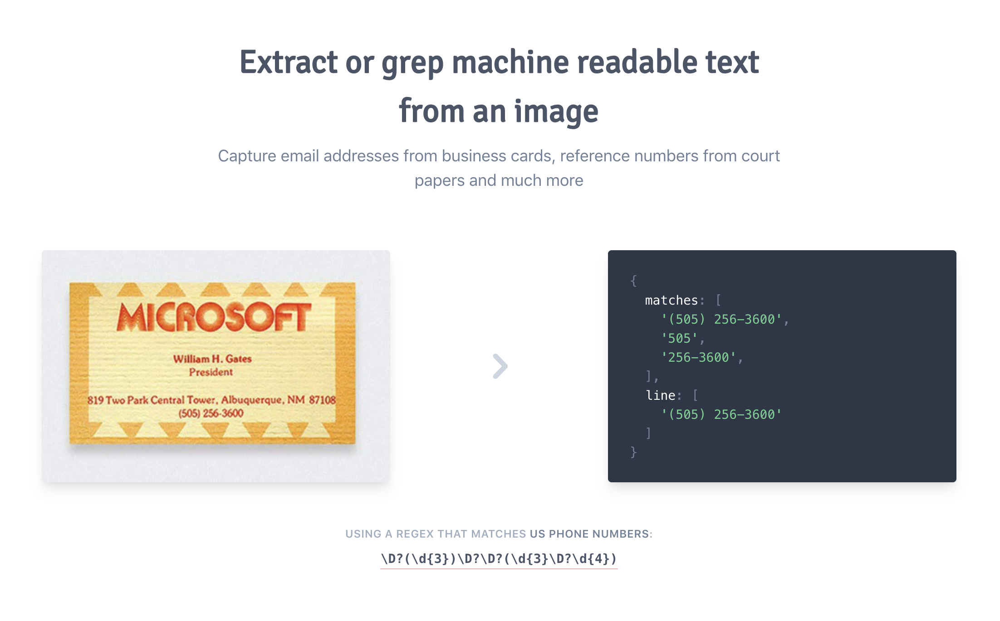

# ImgRegex

The project was a wrapper around the visual recognition API from AWS but didn't take off so I shut it down. The page was lightning fast because it was deployed to edge nodes around the world and lighthouse optimized (100 score).

Just clone it and spin it up locally to check out the frontend. The API is not deployed currently, so the core ORC functionality doesn't work.
